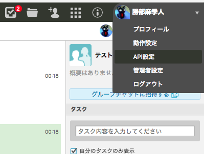

# INSTALL

## 目次
1. [Chatwork](#chatwork)
    1. [APITokenを取得](#apitokenを取得)
    2. [ルームIDを取得](#ルームidを取得)
1. [Redmine](#redmine)
    1. [RESTの使用を許可](#restの使用を許可)
    2. [APIアクセスキーを取得](#apiアクセスキーを取得)
    3. [ProjectIDを取得](#projectidを取得)
1. [GoogleAppsScriptの設定](#googleappsscriptの設定)
    1. アプリを追加
    2. GASプロジェクトの作成
    3. スクリプトをセットし実行

## Chatwork
### APITokenを取得
Chatworkへボット用ユーザーでログインします。  
その後右上のメニューから「API設定」を押下。  

ログイン時に使用したパスワードを入力し「表示」ボタンを押下。  

API Tokenが表示されるのでメモしておきます。  

### ルームIDを取得
botから投稿したい部屋を表示します。この時のURLの一部がルームIDになります。以下の場合は`92709970`が該当しますので、これをメモしておきます。  

## Redmine
### RESTの使用を許可
Redmineに管理者ユーザーでログインします。  
左上のメニューにある`管理`から`設定`→`API`とたどり、「RESTによるWebサービスを有効にする」にチェック、「保存」ボタンを押下します。   

### APIアクセスキーを取得
botが使用するRedmine側のユーザーでログインします。  
APIアクセスキーが漏れた場合などを考慮し、専用のユーザーを作成し最低限の権限のみ付与しておくのがおすすめです。

ログインできたら画面右上の`個人設定`をクリックし設定画面を表示します。画面右側に「APIアクセスキー」とある部分の「表示」リンクを押下。  

APIアクセスキーが表示されるのでこれをメモしておきます。  

### ProjectIDを取得
新しくプロジェクトを作成する際に「識別子」を入力していると思いますが、これをメモしておきます。  

URLの一部にもなっています。以下の場合は`test`が該当します。  

## GoogleAppsScriptの設定
### アプリを追加
GoogleAppsScript(以降GAS)を導入していない場合にこの作業が必要になります。WebブラウザからGoogleDriveにログインをし、`新規`→`その他`→`アプリを追加`とたどります。  

Google Apps Scriptの項目を見つけ（もしくは検索し）、`+接続`ボタンを押下します。  

### GASプロジェクトの作成
`新規`→`その他`→`Google Apps Script`とたどります。  

画面の左上をクリックしプロジェクト名を適当に入力します。GoogleDrive上のファイル名にもなりますので管理しやすい物が良いでしょう。ちなみにDrive上でファイルの場所を移動してもトリガーの動作には影響しません。  

必要な「ライブラリ」を入れます。  
このスクリプトは`ChatWorkClient`を必要としますので、`リソース`メニューから`ライブラリ`を選択します。  

テキストボックスに`M6TcEyniCs1xb3sdXFF_FhI-MNonZQ_sT`を入力し`追加`ボタンを押下します。このライブラリはChatwork社の中の方が作成された非公式ライブラリです。[GitHubのリポジトリはこちら](https://github.com/cw-shibuya/chatwork-client-gas)。  

バージョンで`18`または最新の物を選択し最後に`保存`ボタンを押下します。`×`で閉じてしまうとライブラリが追加されませんので注意が必要です。  

### スクリプトをセットし実行
本リポジトリの[checkRedmine.js](https://github.com/katsube/redmine2chatwork/blob/master/GoogleAppsScript/checkRedmine.js)の中身をGASのエディタにコピペします。

変数`CONFIG`の中身を適宜編集し、**必ず保存**します。保存していないと次のステップが実行できません。  

`実行`→`関数を実行`→`executeMe`とたどります。  

このあと指定したChatworkの部屋に投稿されていれば成功です。
